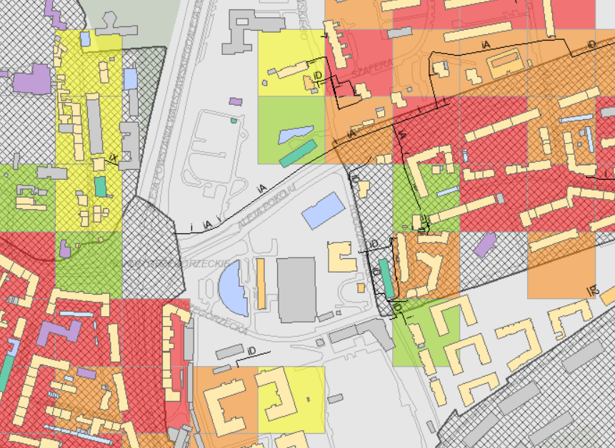

# Ćwiczenie 1

korzystając z Miejskiego Systemu Informacji Prestrzennej (http://msip.um.krakow.pl/obserwatorium/)
Wybrać dowolną ulicę w Krakowie zaczynającą się taką samą literę jak Wasze imie i numer adresowy taki jak dwie ostatnie cyfry Waszego numer albumu.
Dla tego adresu proszę przygotować 3 wydruki dla otoczenia (r ~100m) tego adresu:
1. wybrane 3 warstwy wektorowe

2. wybraną warstwę rastrową

3. wybrane ciekawe informacje przydatne w projektowaniu.
Przedstawić w formie pliku pdf i przesłać na adres mailowy.

# Ćwiczenie 2

Dla dwóch warstw wektorowych zamieszczonych w tym folderze: https://github.com/RafalKucharskiPK/Model_Ogolny_Miejskiej_Mobilnosci/tree/master/dane/MOMM/warstwy_shp

określić liczbę budynków w promieniu 500m od przystanku o numerze zakończonym tak jak dwie ostatnie cyfry numeru albumu.

Oprogramowanie:
1. qGIS (bez wsparcia prowadzącego...)
2. PTV Visum (ze wsparciem prowadzącego, pobranie wersji studenckiej: http://cgi.ptvgroup.com/php/lng/vision_student_download.php?lng=en)

Narzędzia (PTV Visum).
Operacje:

* Import shapefile
  * przystanki jako _Stops_
  * budynki jako _territories_ (_read additively_)
  * read additevely
* Calculate/Procedures create: Miscellaneous/Intersect
  * Target: _Stops_ (koleje) Buffer size _500 m_ (100, 300 i 500 - trzy warianty)
  * Source: _Territories_ (miejscowosci) Buffer size_0m_ 
  * Destination attribute _ADDVAL1_
  * Source attribute _1.0_
 * Odczytaj wartości dla przystanku w trzech wartościach promienia: _100m, 300m, 500m_ (kliknij dwa razy w obiekt i odczytaj)
 * Preślij w formie wydruku pdf na adres mailowy
 
 
 
